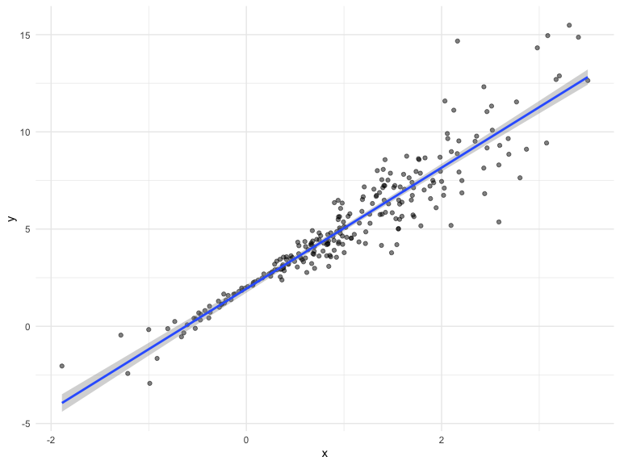
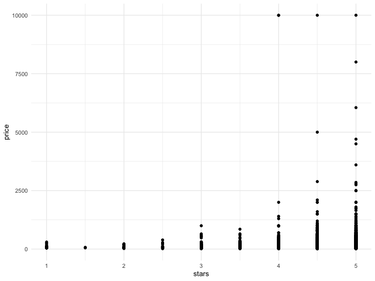
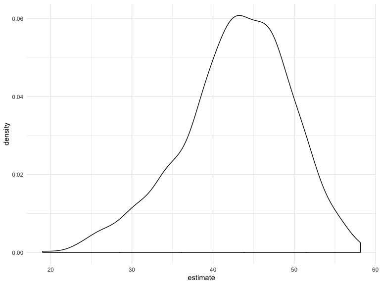

bootstrapping
================
Martha Mulugeta
11/14/2019

``` r
n_samp = 250

##simulated data frame with constant variance
sim_df_const = 
  tibble(
    x = rnorm(n_samp, 1, 1),
    error = rnorm(n_samp, 0, 1),
    y = 2 + 3 * x + error
  )

##simulated data frame with non-constant variance
sim_df_nonconst = sim_df_const %>% 
  mutate(
  error = error * .75 * x,
  y = 2 + 3 * x + error
)
```

``` r
sim_df = 
  bind_rows(const = sim_df_const, nonconst = sim_df_nonconst, .id = "data_source") 

sim_df %>% 
  ggplot(aes(x = x, y = y)) + 
  geom_point(alpha = .5) +
  stat_smooth(method = "lm") +
  facet_grid(~data_source) 
```


Fit two models…

``` r
sim_df_const %>% 
  lm(y ~ x, data = .) %>% 
  broom::tidy()
```

    ## # A tibble: 2 x 5
    ##   term        estimate std.error statistic   p.value
    ##   <chr>          <dbl>     <dbl>     <dbl>     <dbl>
    ## 1 (Intercept)     1.98    0.0981      20.2 3.65e- 54
    ## 2 x               3.04    0.0699      43.5 3.84e-118

``` r
sim_df_nonconst %>% 
  lm(y ~ x, data = .) %>% 
  broom::tidy()
```

    ## # A tibble: 2 x 5
    ##   term        estimate std.error statistic   p.value
    ##   <chr>          <dbl>     <dbl>     <dbl>     <dbl>
    ## 1 (Intercept)     1.93    0.105       18.5 1.88e- 48
    ## 2 x               3.11    0.0747      41.7 5.76e-114

``` r
##variance is very similar here; but variance should be moving a little more in non-constant model than constant
```

## how can I bootstrap?

Write a function to draw a bootstrap sample based on a dataframe

``` r
boot_sample = function(df) {
   sample_frac(df, size = 1, replae = TRUE) 
}

##size here represents a proportion/fraction you are taking--100%; you want the sample size to stay the same here 
```

``` r
boot_sample(sim_df_nonconst) %>% 
  ggplot(aes(x = x, y = y)) +
  geom_point(alpha = .5) +
  stat_smooth(method = "lm")
```



Organize a dataframe…

``` r
boot_straps =
  tibble(
    strap_num = 1:1000,
    strap_sample = rerun(1000, boot_sample(df = sim_df_nonconst))
  )

boot_straps
```

    ## # A tibble: 1,000 x 2
    ##    strap_num strap_sample      
    ##        <int> <list>            
    ##  1         1 <tibble [250 × 3]>
    ##  2         2 <tibble [250 × 3]>
    ##  3         3 <tibble [250 × 3]>
    ##  4         4 <tibble [250 × 3]>
    ##  5         5 <tibble [250 × 3]>
    ##  6         6 <tibble [250 × 3]>
    ##  7         7 <tibble [250 × 3]>
    ##  8         8 <tibble [250 × 3]>
    ##  9         9 <tibble [250 × 3]>
    ## 10        10 <tibble [250 × 3]>
    ## # … with 990 more rows

Do some kind of ananlysis…

``` r
bootstrap_results = 
  boot_straps %>% 
  mutate(
   models = map(strap_sample, ~lm(y ~ x, data = .x)),
   results = map(models, broom::tidy)
  ) %>% 
  select(-strap_sample, -models) %>% 
  unnest(results)
```

Summarize these results

``` r
bootstrap_results %>% 
  group_by(term) %>% 
  summarize(se = sd(estimate))
```

    ## # A tibble: 2 x 2
    ##   term              se
    ##   <chr>          <dbl>
    ## 1 (Intercept) 3.39e-15
    ## 2 x           2.08e-15

## Try the modelr package

``` r
boot_straps = 
  sim_df_nonconst %>% 
  modelr::bootstrap(1000) %>% 
  mutate(
    models = map(strap, ~lm(y ~ x, data = .x) ),
    results = map(models, broom::tidy)) %>% 
  select(-strap, -models) %>% 
  unnest(results) %>% 
  group_by(term) %>% 
  summarize(boot_se = sd(estimate))

##generating samples without sample fractions and such previously; everything else is the same
```

## What if your assumptions aren’t wrong?

``` r
sim_df_const %>% 
  lm(y ~ x, data = .) %>% 
  broom::tidy()
```

    ## # A tibble: 2 x 5
    ##   term        estimate std.error statistic   p.value
    ##   <chr>          <dbl>     <dbl>     <dbl>     <dbl>
    ## 1 (Intercept)     1.98    0.0981      20.2 3.65e- 54
    ## 2 x               3.04    0.0699      43.5 3.84e-118

``` r
sim_df_const %>% 
  modelr::bootstrap(1000) %>% 
  mutate(
    models = map(strap, ~lm(y ~ x, data = .x) ),
    results = map(models, broom::tidy)) %>% 
  select(-strap, -models) %>% 
  unnest(results) %>% 
  group_by(term) %>% 
  summarize(boot_se = sd(estimate))
```

    ## # A tibble: 2 x 2
    ##   term        boot_se
    ##   <chr>         <dbl>
    ## 1 (Intercept)  0.0986
    ## 2 x            0.0725

``` r
##If assumptions are correct, bootstrap is doing what you expect it to do; but where assumptions are not met, bootstrap accounts for that 
```

\#\#Revisit airbnb data

``` r
data("nyc_airbnb")

nyc_airbnb = 
  nyc_airbnb %>% 
  mutate(stars = review_scores_location / 2) %>% 
  rename(
    boro = neighbourhood_group,
    neighborhood = neighbourhood) %>% 
  filter(boro != "Staten Island") %>% 
  select(price, stars, boro, neighborhood, room_type)
```

``` r
nyc_airbnb %>% 
  ggplot(aes(x = stars, y = price)) + 
  geom_point() 
```



Re-use the stuff I just did…

``` r
airbnb_results = 
  nyc_airbnb %>% 
  filter(boro == "Manhattan") %>% 
  modelr::bootstrap(1000) %>% 
  mutate(
    models = map(strap, ~lm(price ~ stars, data = .x) ),
    results = map(models, broom::tidy)) %>% 
  select(-strap, -models) %>% 
  unnest(results) 
```

Make a plot of `stars` distribution

``` r
airbnb_results %>% 
  filter(term == "stars") %>% 
  ggplot(aes(x = estimate)) +
  geom_density()
```



``` r
##this distribution is skewed; expect normal distribution, but this one is not 
```
