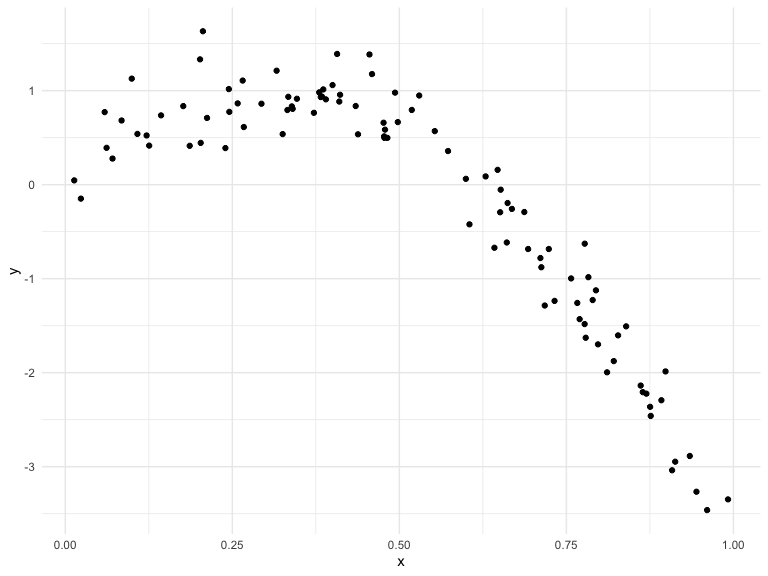
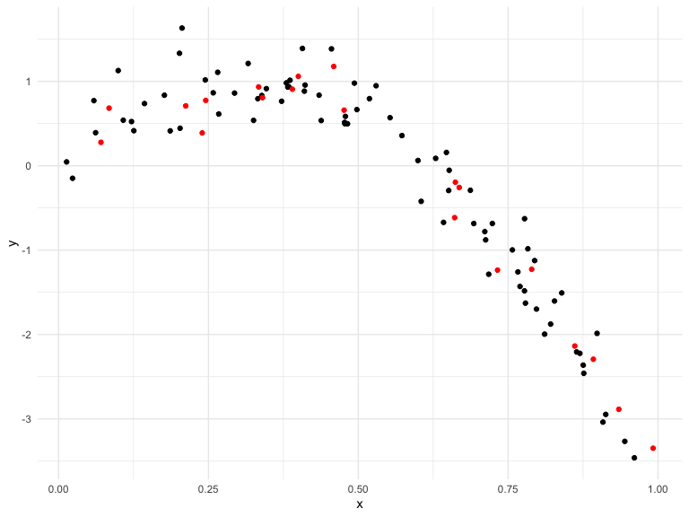
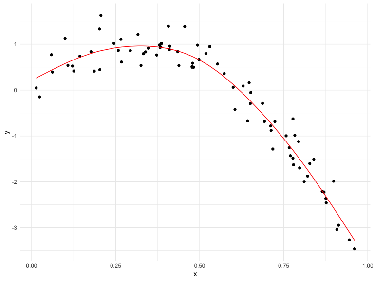
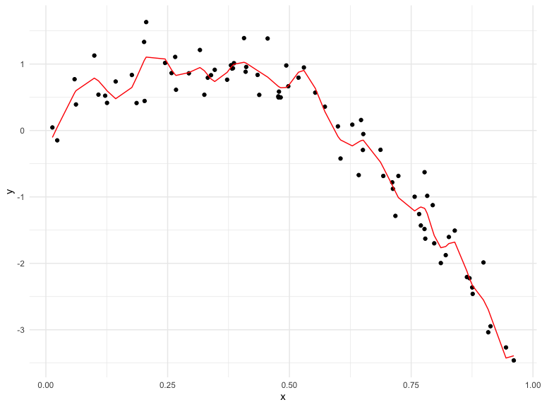

cross\_validation
================
Martha Mulugeta
11/12/2019

## Cross validation

Generate a dataset

``` r
nonlin_df = 
  tibble(
    id = 1:100,
    x = runif(100, 0, 1),
    y = 1 - 10 * (x - .3) ^ 2 + rnorm(100, 0, .3)
  )

nonlin_df %>% 
  ggplot(aes(x = x, y = y)) + 
  geom_point()
```



Training and testing anti\_join – give me everything that does not
appear in the training dataset from the nonlin df for the testing
dataset

``` r
train_df = sample_frac(nonlin_df, size = .8)
test_df = anti_join(nonlin_df, train_df, by = "id")

ggplot(train_df, aes(x = x, y = y)) + 
  geom_point() + 
  geom_point(data = test_df, color = "red")
```



Fit three models of varying goodness

``` r
linear_mod = lm(y ~ x, data = train_df)
smooth_mod = mgcv::gam(y ~ s(x), data = train_df)
wiggly_mod = mgcv::gam(y ~ s(x, k = 30), sp = 10e-6, data = train_df)
```

Let’s look at some fits

``` r
##Fitting models based on training datasets
train_df %>% 
  add_predictions(linear_mod) %>% 
  ggplot(aes(x = x, y = y)) + 
  geom_point() + 
  geom_line(aes(y = pred), color = "red")
```


``` r
##Not a good fit; worst

train_df %>% 
  add_predictions(smooth_mod) %>% 
  ggplot(aes(x = x, y = y)) + 
  geom_point() + 
  geom_line(aes(y = pred), color = "red")
```



``` r
##This is a great fit; best

train_df %>% 
  add_predictions(wiggly_mod) %>% 
  ggplot(aes(x = x, y = y)) + 
  geom_point() + 
  geom_line(aes(y = pred), color = "red")
```



``` r
##Better than linear regression, which missed curves, but this is doing too much; great for this dataset, but wouldn't be for some dataset you haven't seen before; second best
```

``` r
##Using the models made with the training datasets to predict the testing datasets; Smaller numbers are better than larger, but it is more relative than absolute
rmse(linear_mod, test_df)
```

    ## [1] 0.7052956

``` r
rmse(smooth_mod, test_df)
```

    ## [1] 0.2221774

``` r
rmse(wiggly_mod, test_df)
```

    ## [1] 0.289051

``` r
##Tells us how well at predicting the model is; always pick the model that predicts the testing dataset better, not modeling the training dataset
```

## Do this all using `modelr` package

``` r
##Take in dataframe, want 20% in test df and 80% in training df, and run this 100 training-testing pairs and save them into df
cv_df = 
  crossv_mc(nonlin_df, 100) 
```

One note about
resample…

``` r
##Pull out training first training/testing split. Can pull the lists out individually and manipulate them
cv_df %>% pull(train) %>% .[[1]] %>% as_tibble
```

    ## # A tibble: 79 x 3
    ##       id      x       y
    ##    <int>  <dbl>   <dbl>
    ##  1     1 0.266   1.11  
    ##  2     2 0.372   0.764 
    ##  3     3 0.573   0.358 
    ##  4     4 0.908  -3.04  
    ##  5     6 0.898  -1.99  
    ##  6     7 0.945  -3.27  
    ##  7     8 0.661  -0.615 
    ##  8     9 0.629   0.0878
    ##  9    10 0.0618  0.392 
    ## 10    11 0.206   1.63  
    ## # … with 69 more rows

``` r
##Not a fundamental change; went from storing rows to storing the dataframes to allow us to fit models
cv_df =
  cv_df %>% 
  mutate(
    train = map(train, as_tibble),
    test = map(test, as_tibble))
```

Try fitting the linear model to all of these…

``` r
cv_df %>% 
  mutate(
    linear_mod = map(train, ~lm(y ~ x, data = .x)),
    smooth_mod = map(.x = train, ~gam(y ~s(x), data = .x)),
    wiggly_mod  = map(train, ~gam(y ~ s(x, k = 30), sp = 10e-6, data = .x)),
    rmse_lin = map2_dbl(linear_mod, test, ~rmse(model = .x, data = .y)),
    rmse_smooth = map2_dbl(smooth_mod, test, ~rmse(model = .x, data = .y)),
    rmse_wiggly = map2_dbl(wiggly_mod, test, ~rmse(model = .x, data = .y)))      
```

    ## # A tibble: 100 x 9
    ##    train test  .id   linear_mod smooth_mod wiggly_mod rmse_lin rmse_smooth
    ##    <lis> <lis> <chr> <list>     <list>     <list>        <dbl>       <dbl>
    ##  1 <tib… <tib… 001   <lm>       <gam>      <gam>         0.675       0.298
    ##  2 <tib… <tib… 002   <lm>       <gam>      <gam>         0.655       0.336
    ##  3 <tib… <tib… 003   <lm>       <gam>      <gam>         0.785       0.295
    ##  4 <tib… <tib… 004   <lm>       <gam>      <gam>         0.874       0.263
    ##  5 <tib… <tib… 005   <lm>       <gam>      <gam>         0.784       0.250
    ##  6 <tib… <tib… 006   <lm>       <gam>      <gam>         0.844       0.324
    ##  7 <tib… <tib… 007   <lm>       <gam>      <gam>         0.791       0.274
    ##  8 <tib… <tib… 008   <lm>       <gam>      <gam>         0.758       0.310
    ##  9 <tib… <tib… 009   <lm>       <gam>      <gam>         0.621       0.287
    ## 10 <tib… <tib… 010   <lm>       <gam>      <gam>         0.839       0.338
    ## # … with 90 more rows, and 1 more variable: rmse_wiggly <dbl>

Visualize this

cv\_df %\>% select(starts\_with(“rmse”)) %\>% pivot\_longer(
everything(), names\_to = “model”, values\_to = “rmse”, names\_prefix =
“rmse\_”) %\>% mutate(model = fct\_inorder(model)) %\>% ggplot(aes(x =
model, y = rmse)) + geom\_violin() \#\#Pick smooth model based on this
